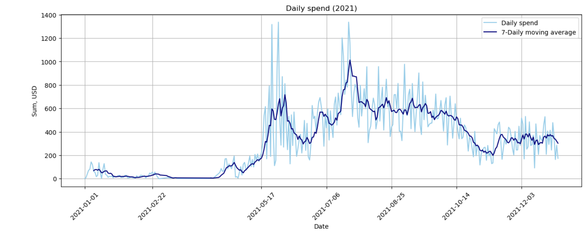
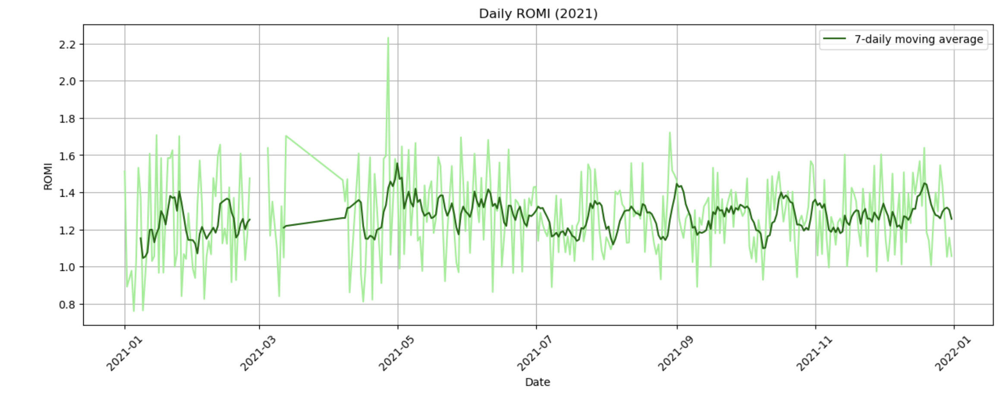
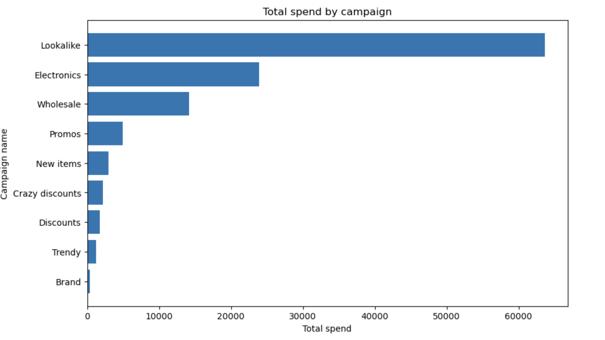
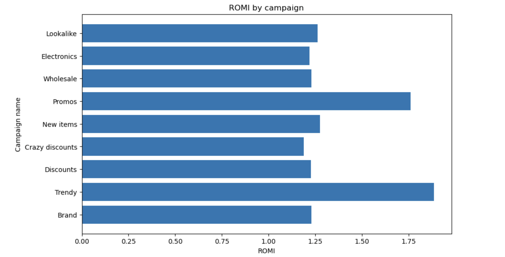
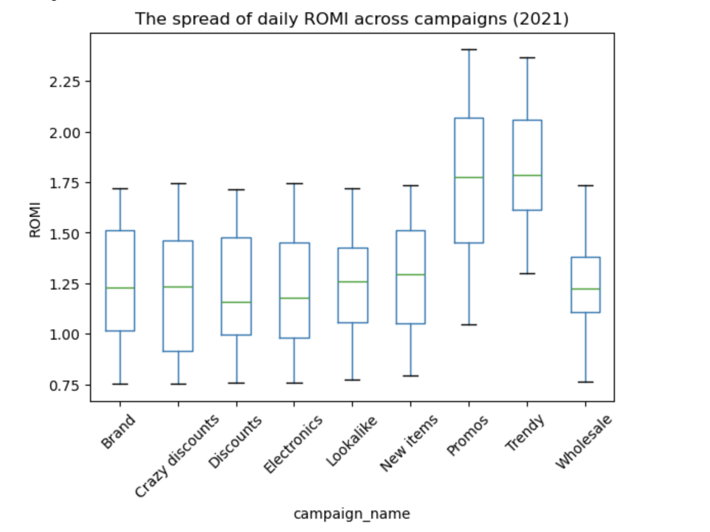
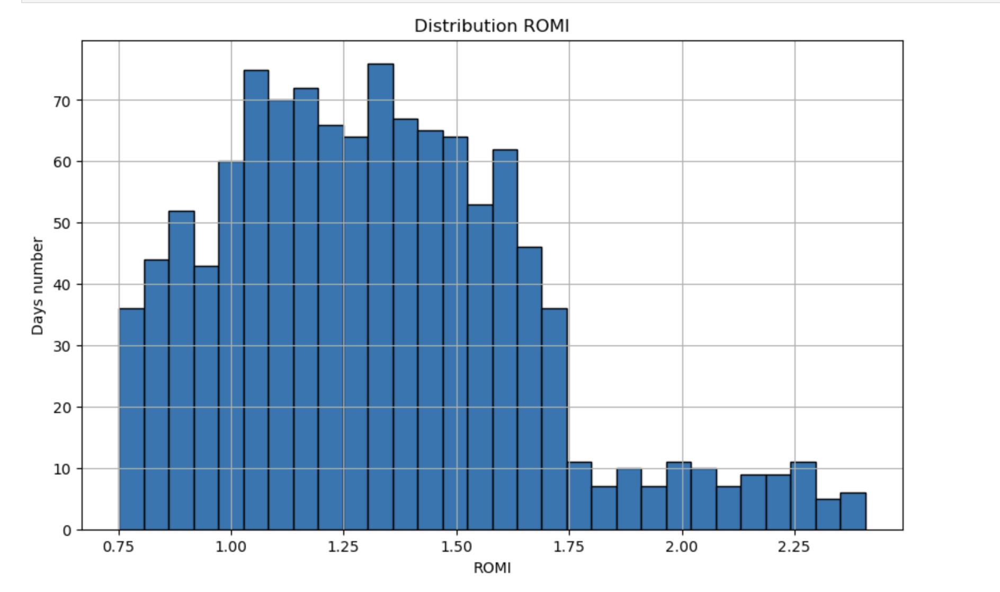
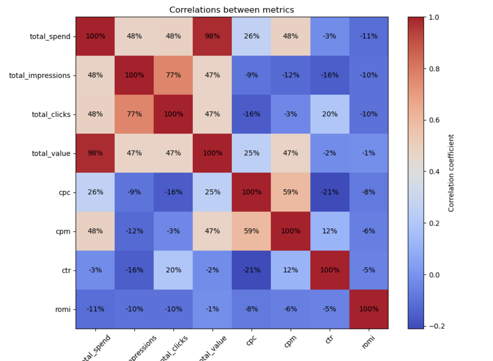

Goal

Using pandas, matplotlib.pyplot, and seaborn, based on a CSV file with advertising campaign data:
1.	Build visualizations showing changes in daily spend and ROMI in 2021.
2.	Analyze total spend and total ROMI across advertising campaigns.
3.	Identify the distribution (spread) of daily ROMI for each campaign (boxplot).
4.	Build a histogram of ROMI distribution.
5.	Show the correlation between all numerical metrics.
6.	Visualize the relationship between total_spend and total_value.

Data

[facebook_ads_data](./facebook_ads_data(2.0).csv/)

Work Done

Data Preparation & Processing 
•	Grouped the data by day for the year 2021
•	Calculated ROMI, moving average of spend, and moving average of ROMI
[Data Preparation](./python/01_data_preparation/)

Trend Analysis

•	Built a chart of daily spend in 2021
[Daily Spend](./python/02_daily_spend_chart/)

•	Built a chart of daily ROMI in 2021
[Daily ROMI](./python/03_daily_romi_chart/)

Campaign-Level Analysis
•	Grouped data by campaign_name
•	Built a chart of total spend for each campaign
[Spend by Campaign](./python/04_total_spend_by_campaign/)

	
•	Built a chart of total ROMI for each campaign
[ROMI by Campaign](./python/05_romi_by_campaign/)

ROMI Exploration
•	Created a boxplot to show the spread of daily ROMI across campaigns
[Boxplot ROMI](./06_boxplot_daily_romi_by_campaign/)

	
•	Built a histogram of ROMI distribution
[ROMI Distribution](./python/07_distribution_romi/)

Correlation Analysis
•	Built a correlation heatmap for all numerical metrics
•	Identified metrics with the highest and lowest correlation values
•	Determined which metrics correlate with total_value
[Correlation](./python/08_cor_between_metrics/)

Relationship Visualization
•	Built a scatterplot with linear regression to visualize the relationship between
total_spend and total_value
[Regression](./09_spend_value/)

Result

A set of visualizations was created to demonstrate:
•	the dynamics of spend and ROMI over time;
•	comparison of metrics across campaigns;
•	ROMI distribution;
•	correlations between all numerical features;
•	the relationship between total_spend → total_value.

This allows for quick insights into the performance and effectiveness of online advertising campaigns.

Tools
•	Python
•	pandas
•	matplotlib
•	seaborn
•	Jupyter Notebook / Google Colab
